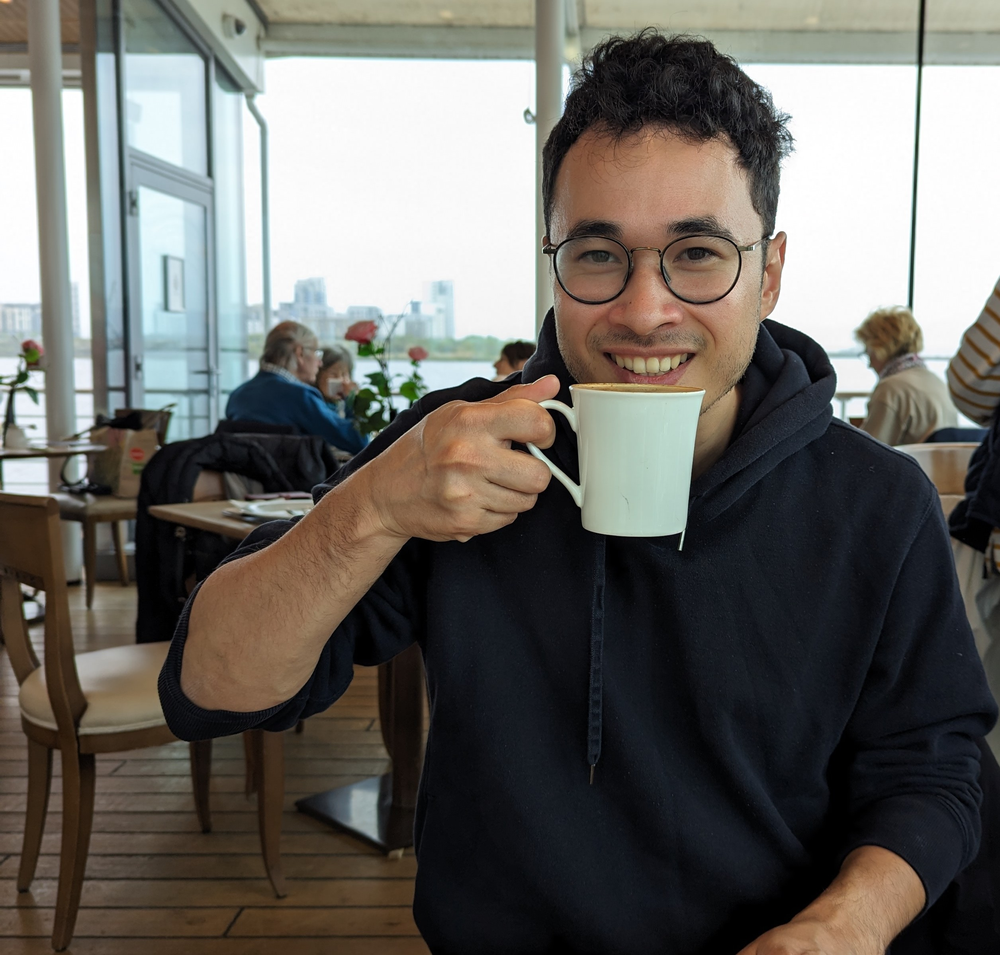

---

I am a PhD student in computer science at <a href="https://www.aifb.kit.edu/english/" target="_blank">Karlsruhe Institute of Technology</a> and research associate at <a href="https://kastel-labs.de/" target="_blank">KASTEL Security Research Labs</a>.

---

## Interests

In my research, I explore how to collaborate in training  and using machine learning models.

I focus on developing collaborative and distributed machine learning systems—such as federated, split, and gossip learning—that are robust and scalable to large numbers of users. 

I am particularly interested in how theoretical advancements  can translate into impactful real-world applications, for example, in personalized healthcare and drug development.

Outside of research, I play the piano, violine, and tennis. I am also casually interested in finance, fungi, and plants, and enjoy listening to podcasts and read books. I am always open to learning more. Feel free to reach out if you'd like to connect!

---

## Selected Publications

1. <a href="https://arxiv.org/abs/2309.16584" target="_blank">Collaborative Distributed Machine Learning</a> 
<i>Jin, Kannengießer, Rank, and Sunyaev</i>
2. <a href="https://publikationen.bibliothek.kit.edu/1000137879" target="_blank">Tackling Challenges of Robustness Measures in Open Multi-Agent Systems</a> 
<i>Jin, Kannengießer, Sturm, and Sunyaev</i>

---

## Personal Projects
1. <i>SlenDefence:</i> A first-person tower defense game developed using C# and Unity.
2. <i>ReinforcementLearning4Trikes</i>: Optimizing energy usage in autonomous e-trikes using reinforcement learning algorithms, including Q-learning, deep Q-learning, and actor-critic.
3. <i>DeepLearning4SignLanguage</i>: Translating sign language into text using convolutional neural networks.
4. <i>PayWise</i>: A collaborative mobile payment app for restaurant bills build with NativeScript.

---

> "Even top-ranked tennis players win barely more than half of the points they play [54\%]. When you lose every second point, on average, you learn not to dwell on every shot."
>
> Roger Federer
