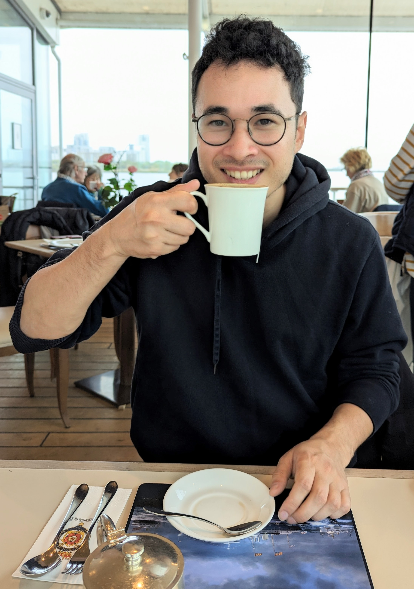

## About Me

Hi! I am a PhD student of Computer Science at Karlsruhe Institute of Technology.

## Research Interest

My research concerns the development of robust collaborative and distributed machine learning systems.

## Publications

1. Jin, Kannengiesser, Rank, and Sunyaev: Collaborative Distributed Machine Learning
2. Jin, Kannengiesser, Sturm, and Sunyaev: Tackling Challenges of Robustness Measures in Open Multi-Agent Systems

## Projects

